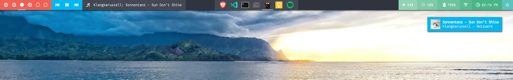

# 🚀 Polydock

**Polydock** is a fast and hackable application dock for your desktop.



## ❓ Why another dock

I recently started using [bspwm](https://github.com/baskerville/bspwm) as my main window manager. Since **bspwm** is a tiling wm, most navigation is done using the keyboard. The only thing I really missed was the ability to quickly glance at a list of open, hidden, and grouped windows.

[Polybar](https://github.com/polybar/polybar) is a beautiful status bar, but unfortunately lacks the ability to show a window list. Since I couldn't find a good looking, customizable dock, I decided to build one myself, that can easily be styled to blend into any existing status bar. *(I'm also terrible coming up with great project names)*

## ✨ Features

* highly customizable (see [settings.ini](https://github.com/folke/polydock/blob/master/config/settings.ini))
* themeable with [Gtk+ CSS](https://developer.gnome.org/gtk3/stable/chap-css-overview.html) (see  [themes/default.css](https://github.com/folke/polydock/blob/master/config/themes/default.ini))
* window grouping based on any combination of (example for a Google Chrome web app):
  * **window class**: `Google Chrome`
  * **instance**: `mail.google.com`
  * **title**: `Inbox (123)`
  * **visibility**: useful if you want to separate hidden/visible windows in different groups
* limit the dock to windows on the current workspace or all workspaces
* show only visible windows, hidden windows, or both
* updates icon when it changes in the application (great for google chrome web application windows)
* rules to define custom icons
* clicking on a group cycles through the windows in that group
* right click to get a popup with all open windows in that group
* supports custom wm **unhide** commands

  ```ini
  # Example for bspwm:
  unhideCommand = bspc node {window} -g hidden=off -f
  ```

## 📦 Installation

Make sure you have the following libraries on your system:

* `gtk3`
* `gjs`
* `libwnck3`
* `gdk-pixbuf2`

Grab the [latest release](https://github.com/folke/polydock/releases) and unzip it somewhere on your system.

You can start using `polydock` right away from the bin folder:

```shell
$ bin/polydock
```

or, copy the binary and config files to your local directories.

For example:

```shell
$ cp bin/polydock ~/.local/bin

$ cp -rv config ~/.config/polydock
```

## ⚙ Configuration

### `settings.ini`

```ini
[appearance]
#One of top, bottom, left, right
position=top
#One of start, center, end
alignment=center
#Additional offsets to further fine-tune the position of the dock
offsetX=0
offsetY=0
iconSize=40
#Full path to a css file, or 'default'.
#See config/themes/default.css
theme=default

[behavior]
#Specify a list of keys to group windows on: class;instance;title;visibility
groupBy=instance;visibility;
activeWorkspaceOnly=false
showHidden=true
showVisible=true
unhideCommand=bspc node {window} -g hidden=off -f

#Rules for custom icons matching the class::instance of windows
#icon-name=string to be part of class::instance
[icons]
google-agenda=calendar.google.com
gmail=mail.google.com
keep=keep.google.com
messengerfordesktop=www.messenger.com
whatsapp=whatsapp
```

## 🔥 Building from source

**Polydock** is written in Typescript and needs some nodejs packages to transform the source into code that works with [GJS](https://gitlab.gnome.org/GNOME/gjs/-/blob/master/doc/Home.md)

Installing and building has been tested with the package manager **pnpm**, but should also work with **npm** or **yarn**

```shell
$ cd polydock

# Install dependencies
$ pnpm i

# Build bundle
$ pnpm run build

# Run Polydock!
$ dist/bin/polydock
```

## 👋 Contributing

Pull requests are welcome. For major changes, please open an issue first to discuss what you would like to change.

## ⚖ License

[Apache 2.0](https://github.com/folke/polydock/blob/master/LICENSE)

<!-- markdownlint-disable-file MD014 -->
